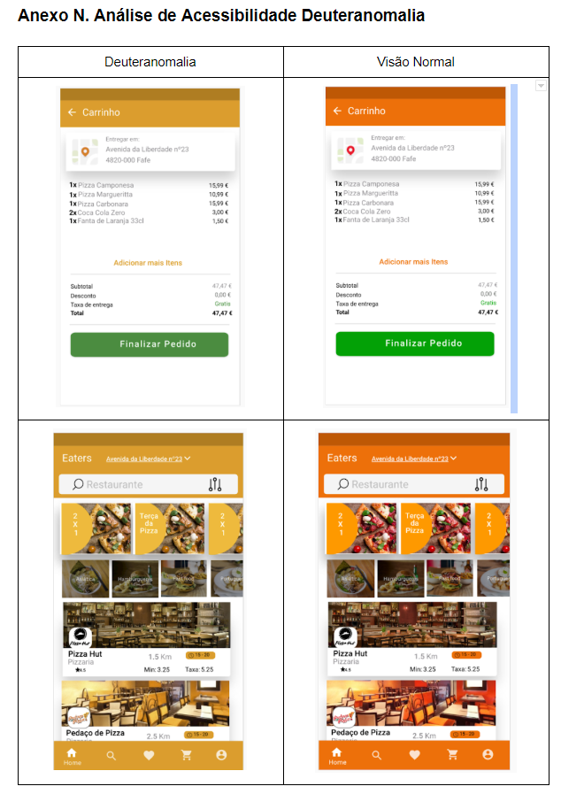

# Eaters
Eaters Projeto de Design Interacao ESTG 2019/2020

Um app android Nativo, de entrega de comida.

Focado em design e navegação, muitos Recyclerviews
Pensado para usuários com visão normal e também daltônicos (deutetonomalia, tritanotopia)...

Concepção de layout e protótipo: 
https://xd.adobe.com/view/6b795fa0-a4b9-4f4e-6af0-9f45bf9c54f1-1d48/

Depois dos testes com usuários parecidos com as nossas personas alteramos o layout para Promoções ficar mais evidente e simplificar a HOME.
