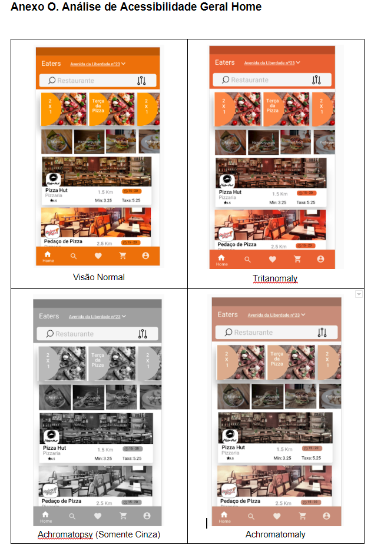
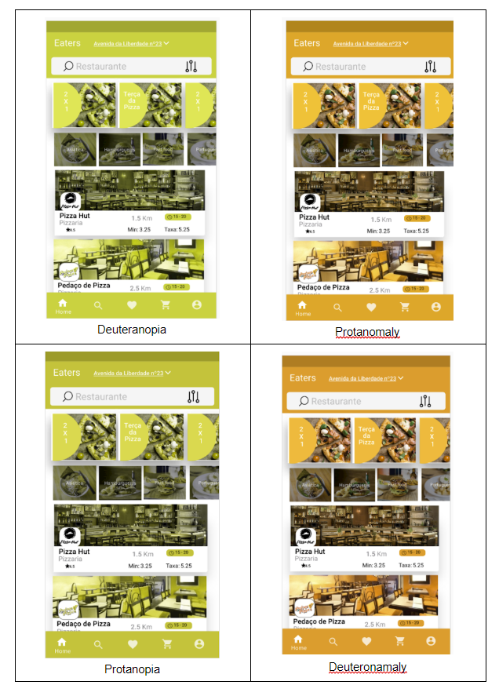

# Eaters
Após criar todo o UX e UI, Resolvi criar o App em Android Nativo em JAVA 
Focado em design e navegação, muitos Recyclerviews com adapters

Eaters Projeto de Design Interação ESTG 2019/2020 (Entrega em Adobe XD)

Pensado para usuários com visão normal e também daltônicos (deutetonomalia, tritanotopia)...

Concepção de layout e protótipo: 
https://xd.adobe.com/view/6b795fa0-a4b9-4f4e-6af0-9f45bf9c54f1-1d48/

Depois dos testes com usuários parecidos com as nossas personas alteramos o layout para Promoções ficar mais evidente e simplificar a HOME.
